# 📊 Assignment Submission Feature - Workflow Diagrams

## 🎓 Complete User Workflow

### Teacher Workflow

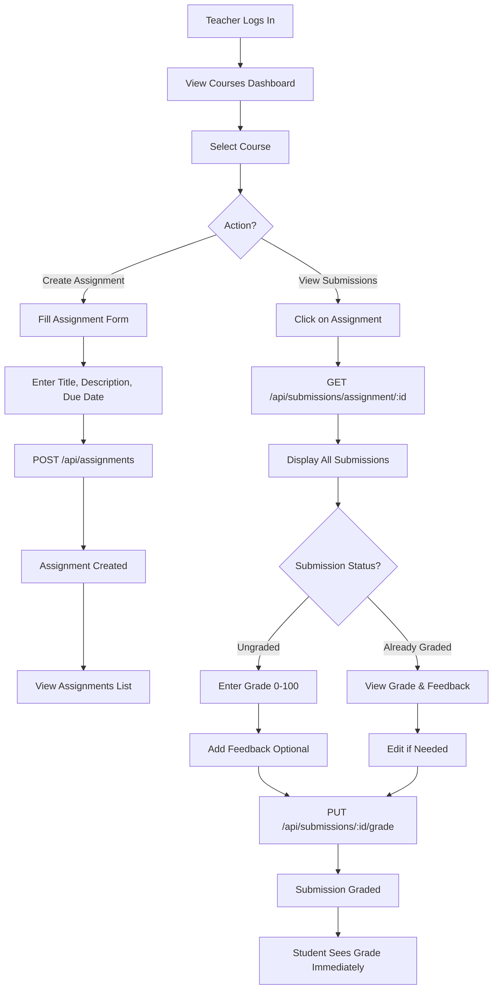

### Student Workflow

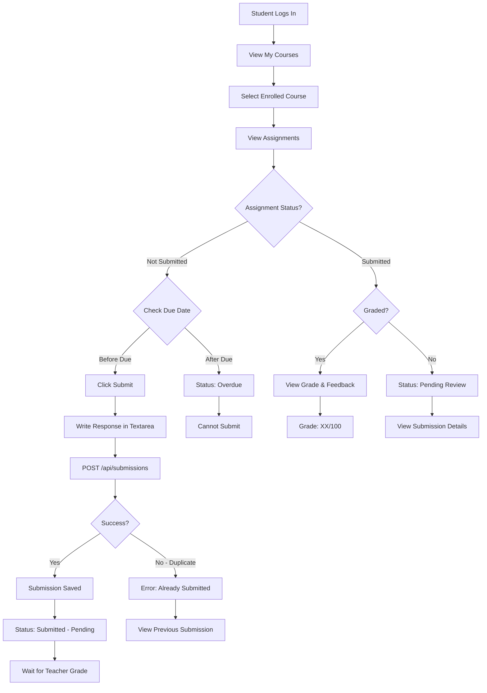

---

## 🔄 Real-Time Visibility Flow

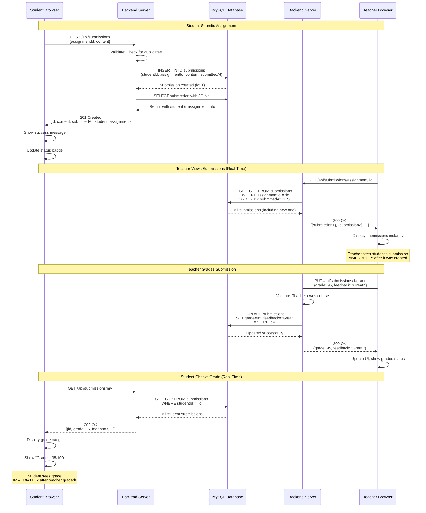

---

## 🗄️ Database Relations Flow

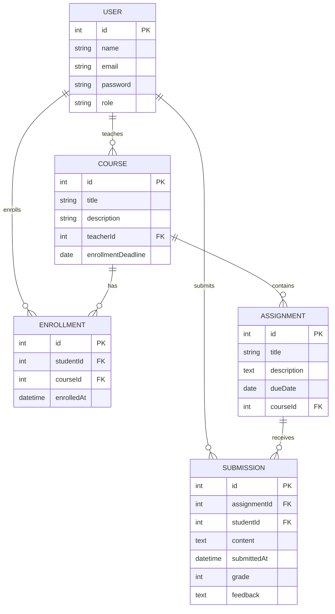

---

## 🔐 Authentication & Authorization Flow

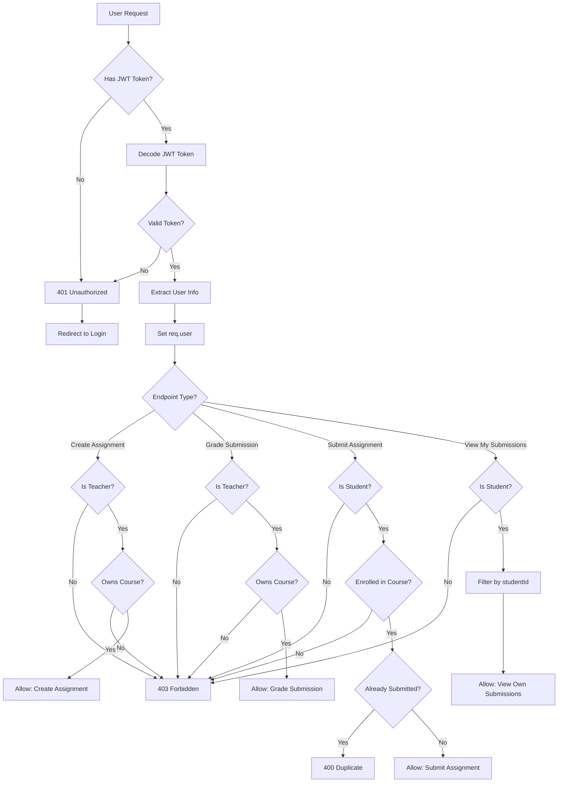

---

## 📱 Frontend Component Architecture

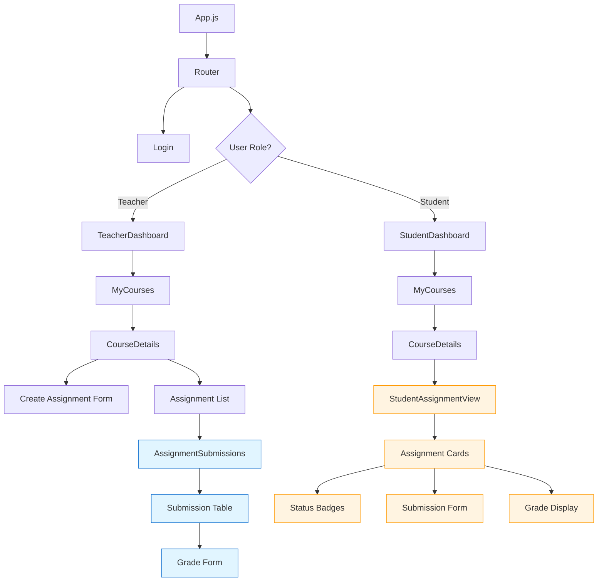

---

## 🎯 Status Badge Logic Flow

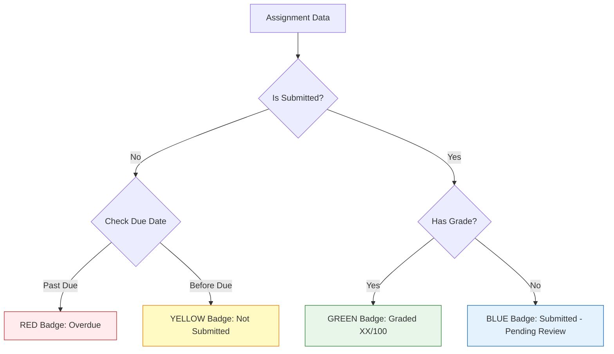

---

## 🚀 Application Startup Flow

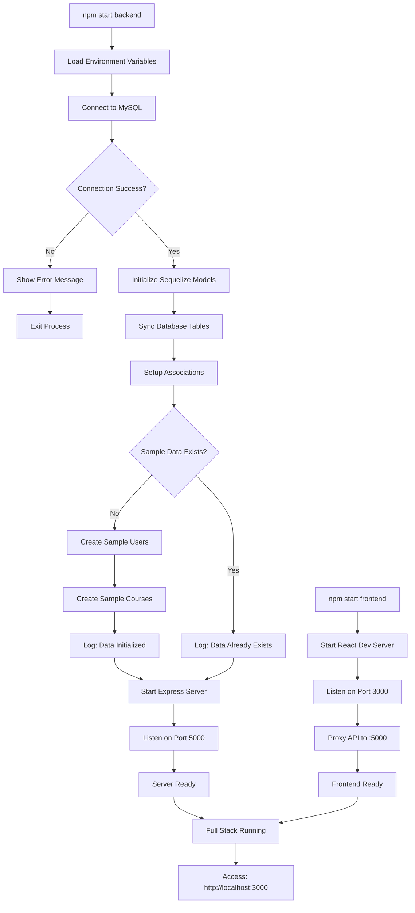

---

## 📊 Data Flow: Submission to Grade

```mermaid
graph LR
    A[Student Types Answer] --> B[Click Submit Button]
    B --> C[Frontend Validation]
    C --> D{Content Empty?}
    
    D -->|Yes| E[Show Error: Enter Content]
    D -->|No| F[POST /api/submissions]
    
    F --> G[Backend: Check Auth]
    G --> H[Backend: Check Duplicate]
    H --> I{Already Submitted?}
    
    I -->|Yes| J[400: Already Submitted]
    I -->|No| K[Create Submission Record]
    
    K --> L[Set submittedAt = NOW]
    L --> M[Save to MySQL]
    M --> N[Return Submission + Details]
    N --> O[Frontend: Update UI]
    O --> P[Show Success Message]
    P --> Q[Change Badge to: Submitted]
    
    R[Teacher Opens Assignment] --> S[GET /api/submissions/assignment/:id]
    S --> T[Fetch All Submissions]
    T --> U[Include Student Info]
    U --> V[Order by submittedAt DESC]
    V --> W[Display in Table]
    
    W --> X[Teacher Enters Grade]
    X --> Y[Teacher Enters Feedback]
    Y --> Z[Click Submit Grade]
    Z --> AA[PUT /api/submissions/:id/grade]
    AA --> AB[Backend: Verify Teacher Owns Course]
    AB --> AC[Update Submission Record]
    AC --> AD[Return Updated Submission]
    AD --> AE[Frontend: Update UI]
    AE --> AF[Show: Graded Badge]
    
    AG[Student Refreshes Page] --> AH[GET /api/submissions/my]
    AH --> AI[Fetch Student Submissions]
    AI --> AJ[Include Grades & Feedback]
    AJ --> AK[Display with Green Badge]
    AK --> AL[Student Sees Grade: XX/100]
```

---

## 🎨 UI State Management

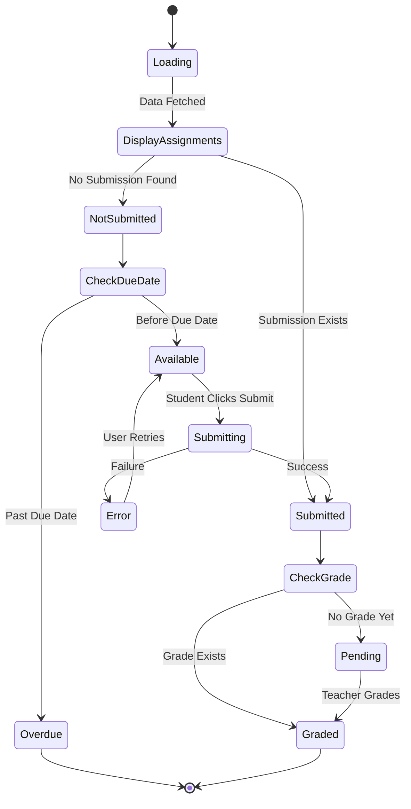

---

## 🔄 Component Lifecycle

### StudentAssignmentView Component

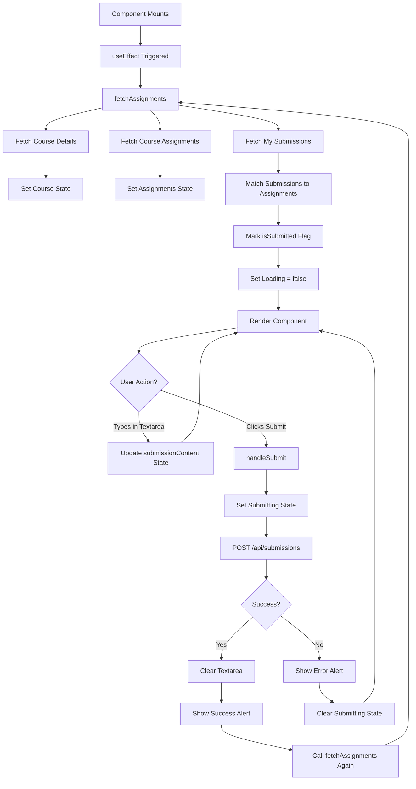

### AssignmentSubmissions Component

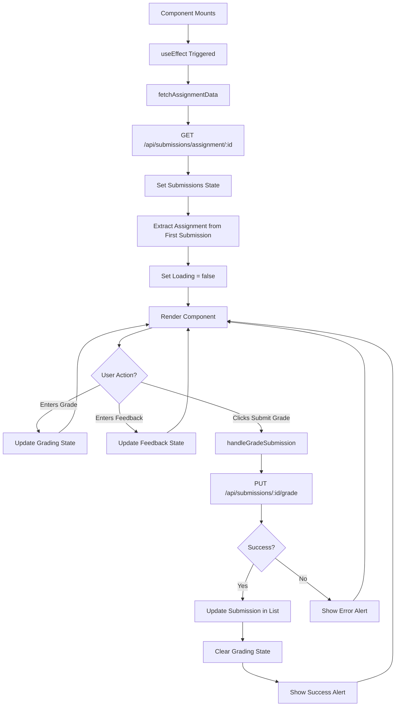

---

## 📈 Performance Optimization

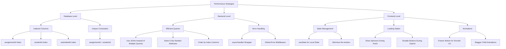

---

These diagrams provide a complete visual overview of the assignment submission feature architecture and workflows!
